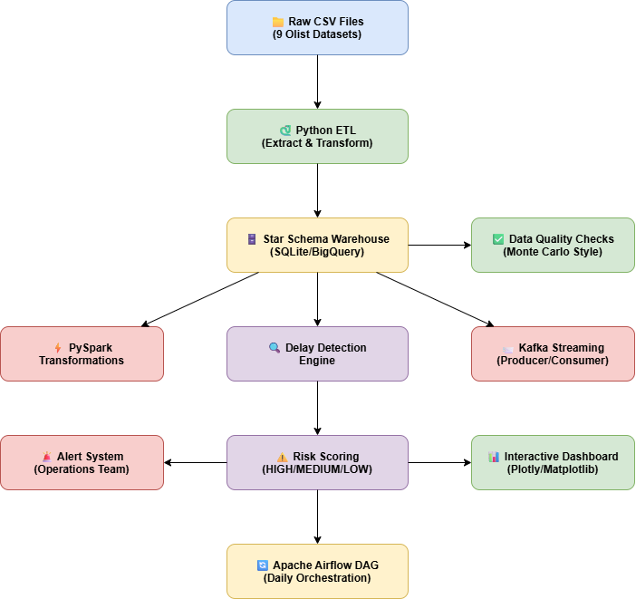

# 🛒 Proactive Retail Order Delay Detection Pipeline

## 📌 Problem Statement
Retail companies lose millions due to delivery delays 
discovered only after customer complaints. This pipeline 
proactively detects and alerts HIGH RISK orders BEFORE 
they become a problem.

## 🏗️ Architecture
Raw CSV Data → Python ETL → Star Schema Warehouse → 
PySpark Transformations → Kafka Streaming → 
Delay Detection → Risk Scoring → Alert System → 
Dashboard → Airflow Orchestration

## 🛠️ Tech Stack
| Technology | Usage |
|------------|-------|
| Python | ETL, Data Processing |
| PySpark | Big Data Transformations |
| SQL/SQLite | Data Warehouse (BigQuery Compatible) |
| Apache Airflow | Pipeline Orchestration |
| Kafka | Real-time Streaming |
| Plotly/Matplotlib | Interactive Dashboards |
| Docker | Containerization |
| GitHub Actions | CI/CD Pipeline |
| Great Expectations | Data Quality |

## 📊 Key Results
- ✅ Processed 99,441 customer records
- ✅ Detected 1,742 delayed orders (7.38%)
- ✅ Identified 797 HIGH RISK orders (3.37%)
- ✅ Top Revenue City: Sao Paulo ($165,607)
- ✅ Business grew 400% from 2016-2018
- ✅ Data Quality Score: 100%
- ✅ Pipeline runs daily via Airflow DAG

## 🔍 Features
- ✅ Automated ETL Pipeline
- ✅ Star Schema Data Warehouse
- ✅ PySpark Big Data Processing
- ✅ Kafka Real-time Streaming
- ✅ Delivery Delay Detection Engine
- ✅ Risk Scoring System (HIGH/MEDIUM/LOW)
- ✅ Automated Alert System
- ✅ Interactive Dashboards
- ✅ Data Quality Checks
- ✅ CI/CD with GitHub Actions
- ✅ Docker Containerization

## 📁 Project Structure
